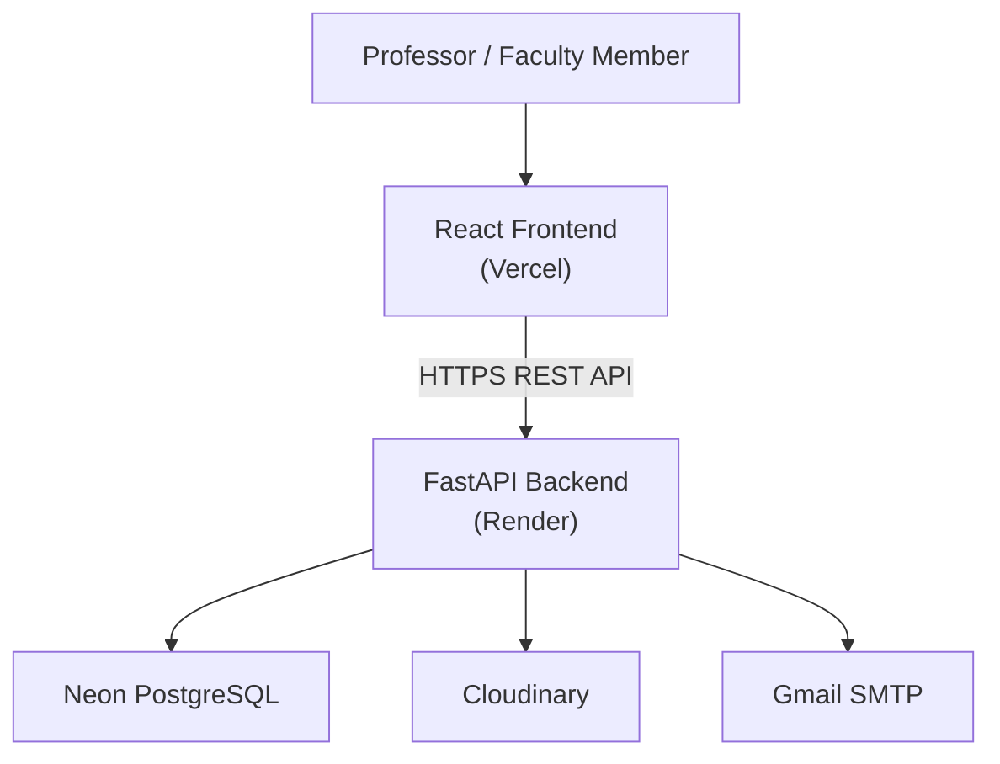

# SnapChecker

SnapChecker is a web-based assessment management system that streamlines the creation, scanning, grading, and management of multiple-choice examinations. The platform enables educators to manage classrooms, create reusable answer sheet templates, automatically grade scanned assessments using Optical Mark Recognition (OMR), and maintain digital grade records in a centralized system.

---

## Live Deployment

The latest production deployment of SnapChecker is available below.

| Service                     | URL                                        |
| --------------------------- | ------------------------------------------ |
| Frontend Application        | https://snap-checker.vercel.app            |
| Backend API                 | https://snapchecker-api.onrender.com       |
| API Documentation (Swagger) | https://snapchecker-api.onrender.com/docs  |
| API Documentation (ReDoc)   | https://snapchecker-api.onrender.com/redoc |

---

## Project Objectives

SnapChecker was designed to modernize the workflow of paper-based multiple-choice examinations by providing a centralized platform that enables educators to:

- Digitize classroom assessment management.
- Reduce manual grading through automated OMR processing.
- Organize assessment records in a centralized system.
- Provide reusable answer sheet templates for future assessments.
- Support secure and scalable deployment using modern cloud infrastructure.

---

## Key Features

### Authentication & Account Management

- Account registration
- Email verification
- Secure JWT-based authentication
- Persistent login using HttpOnly refresh cookies
- Password reset via email
- Password change functionality
- Rate-limited authentication endpoints

### Classroom Management

- Classroom creation and management
- Classroom and deletion
- Storage usage monitoring
- Assessment organization by classroom

### Student Roster Management

- Manual student registration
- CSV roster import
- Student record management
- Duplicate record prevention

### Assessment Management

- Interactive answer sheet template builder
- Configurable examination settings
- Answer key management
- Reusable assessment templates

### Automated Grading

- Examination image upload
- Optical Mark Recognition (OMR)
- Automatic score computation
- Student answer matching
- Missing student detection

### Gradebook & Analytics

- Assessment overview
- Item analysis
- Semester gradebook
- PDF export
- CSV export

---

## Technology Stack

| Layer          | Technologies                              |
| -------------- | ----------------------------------------- |
| Frontend       | React, Vite, Tailwind CSS, Zustand, Axios |
| Backend        | FastAPI, SQLAlchemy, Alembic              |
| Database       | Neon PostgreSQL                           |
| Image Storage  | Cloudinary                                |
| Authentication | JWT, HttpOnly Refresh Cookies             |
| Email Service  | Gmail SMTP                                |
| Deployment     | Vercel, Render                            |

---

## System Overview



The frontend provides the user interface and communicates exclusively with the backend through authenticated REST API requests. The backend manages authentication, business logic, database operations, image processing, and third-party service integrations. Persistent application data is stored in PostgreSQL, uploaded scan images are managed through Cloudinary, and Gmail SMTP is used for account verification and password recovery.

---

## Repository Structure

```text
SnapChecker/
│
├── backend/                  FastAPI backend application
├── frontend/                 React frontend application
├── docs/                     Technical documentation
│   ├── README.md
│   ├── DEVELOPMENT_SETUP.md
│   ├── DEPLOYMENT.md
│   ├── ARCHITECTURE.md
│   ├── DATABASE.md
│   ├── API.md
│   └── PRODUCTION_CHECKLIST.md
│
├── README.md
└── .gitignore
```

Additional technical documentation is available in the **docs** directory.

---

## Local Development

### Prerequisites

- Node.js
- Python 3.13 or later
- PostgreSQL (or Neon PostgreSQL)
- Cloudinary account
- Gmail SMTP account

Clone the repository, configure the required environment variables, install the project dependencies, and start both the backend and frontend development servers.

Complete deployment and environment setup instructions are available in **docs/DEPLOYMENT.md**.

---

## Documentation

The repository includes dedicated technical documentation covering deployment, architecture, database design, backend APIs, and production verification.

| Document                         | Description                                  |
| -------------------------------- | -------------------------------------------- |
| **docs/README.md**               | Documentation index                          |
| **docs/DEVELOPMENT_SETUP.md**    | Local development and installation guide     |
| **docs/DEPLOYMENT.md**           | Deployment and infrastructure guide          |
| **docs/ARCHITECTURE.md**         | System architecture and design               |
| **docs/DATABASE.md**             | Database schema and relationships            |
| **docs/API.md**                  | Backend API reference                        |
| **docs/PRODUCTION_CHECKLIST.md** | Production deployment verification checklist |

---

## License

This repository was developed for educational and institutional use. Licensing, distribution, and continued maintenance should follow the policies established by the project owner or deploying institution.
