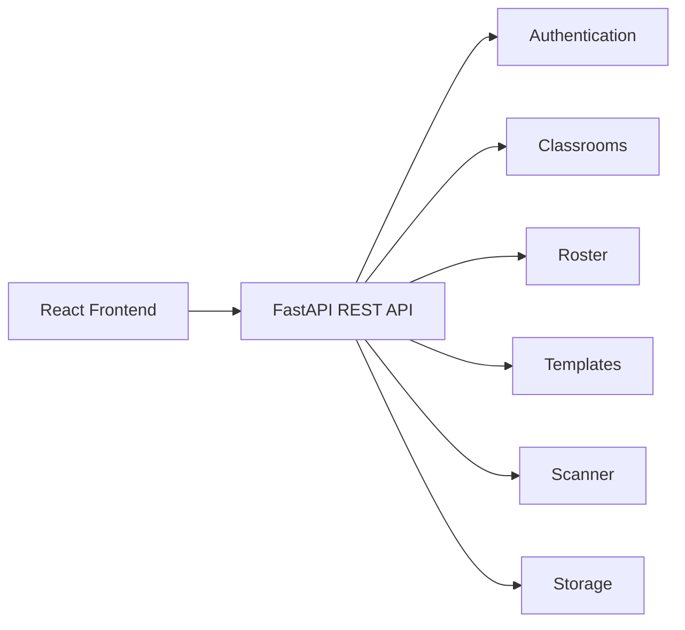

# API Reference

This document provides a high-level reference for the SnapChecker REST API. It describes the available API modules, their responsibilities, authentication requirements, and the primary endpoints exposed by the backend.

Detailed request and response schemas are available through the automatically generated FastAPI Swagger documentation.

---

# API Overview

SnapChecker exposes a RESTful API that serves as the communication layer between the React frontend and the FastAPI backend.

The API is organized into business-oriented modules rather than database entities, allowing related functionality to remain grouped under a common endpoint structure.

---

# Authentication

Authentication is implemented using JWT access tokens together with HttpOnly refresh cookies.

Most endpoints require an authenticated faculty account before access is granted.

---

# API Modules

## Authentication API

Responsible for account management, authentication, and session lifecycle.

| Endpoint                    | Method | Authentication | Purpose                             |
| --------------------------- | ------ | -------------- | ----------------------------------- |
| `/api/auth/register`        | POST   | No             | Register a faculty account          |
| `/api/auth/login`           | POST   | No             | Authenticate user                   |
| `/api/auth/me`              | GET    | Yes            | Retrieve current authenticated user |
| `/api/auth/refresh`         | POST   | Refresh Cookie | Generate a new access token         |
| `/api/auth/logout`          | POST   | Yes            | End the authenticated session       |
| `/api/auth/verify-email`    | GET    | No             | Verify email address                |
| `/api/auth/forgot-password` | POST   | No             | Begin password recovery             |
| `/api/auth/reset-password`  | POST   | No             | Complete password reset             |
| `/api/auth/change-password` | PUT    | Yes            | Update account password             |

---

## Classroom API

Responsible for classroom management and gradebook generation.

| Endpoint                                  | Method | Purpose                                 |
| ----------------------------------------- | ------ | --------------------------------------- |
| `/api/classrooms/`                        | POST   | Create classroom                        |
| `/api/classrooms/`                        | GET    | Retrieve all classrooms                 |
| `/api/classrooms/{id}`                    | GET    | Retrieve classroom dashboard            |
| `/api/classrooms/{id}`                    | PUT    | Update classroom                        |
| `/api/classrooms/{id}`                    | DELETE | Delete classroom and associated records |
| `/api/classrooms/{id}/gradebook`          | GET    | Generate classroom gradebook            |
| `/api/classrooms/{id}/semester-gradebook` | GET    | Generate semester gradebook             |

---

## Roster API

Responsible for managing classroom student records.

| Endpoint                      | Method | Purpose                     |
| ----------------------------- | ------ | --------------------------- |
| `/api/roster/class/{id}`      | GET    | Retrieve classroom roster   |
| `/api/roster/class/{id}`      | POST   | Add student                 |
| `/api/roster/bulk/class/{id}` | POST   | Bulk import students        |
| `/api/roster/class/{id}`      | DELETE | Clear classroom roster      |
| `/api/roster/student/{id}`    | PUT    | Update student              |
| `/api/roster/student/{id}`    | DELETE | Delete student              |
| `/api/roster/template/{id}`   | GET    | Retrieve template scans     |
| `/api/roster/template/{id}`   | PUT    | Update template information |

---

## Template API

Responsible for assessment template lifecycle and answer key management.

| Endpoint                         | Method | Purpose                     |
| -------------------------------- | ------ | --------------------------- |
| `/api/templates/`                | GET    | Retrieve templates          |
| `/api/templates/`                | POST   | Create template             |
| `/api/templates/{id}`            | PUT    | Update template             |
| `/api/templates/{id}`            | DELETE | Archive template            |
| `/api/templates/{id}/answer_key` | PUT    | Save or update answer key   |
| `/api/templates/{id}/missing`    | GET    | Retrieve missing students   |
| `/api/templates/{id}/summary`    | GET    | Retrieve assessment summary |

---

## Scanner API

Responsible for optical mark recognition (OMR), scan management, grading, and assessment analytics.

### Scan Processing

| Endpoint                | Method | Purpose                                              |
| ----------------------- | ------ | ---------------------------------------------------- |
| `/api/scans/`           | POST   | Upload and process examination paper                 |
| `/api/scans/{id}`       | DELETE | Delete scan record                                   |
| `/api/scans/{id}/image` | DELETE | Delete uploaded image while preserving grade records |

### Student Assignment

| Endpoint                              | Method | Purpose                      |
| ------------------------------------- | ------ | ---------------------------- |
| `/api/scans/{id}/assignable-students` | GET    | Retrieve assignable students |
| `/api/scans/{id}/assign-student`      | PUT    | Assign scan to student       |

### Assessment Data

| Endpoint                                 | Method | Purpose                       |
| ---------------------------------------- | ------ | ----------------------------- |
| `/api/scans/template/{id}`               | GET    | Retrieve assessment scans     |
| `/api/scans/template/{id}/missing`       | GET    | Retrieve missing students     |
| `/api/scans/template/{id}/overview`      | GET    | Assessment overview           |
| `/api/scans/template/{id}/item-analysis` | GET    | Item analysis                 |
| `/api/scans/template/{id}/regrade`       | POST   | Regrade assessment            |
| `/api/scans/template/{id}/all`           | DELETE | Remove all assessment records |

### Classroom Data

| Endpoint                    | Method | Purpose                  |
| --------------------------- | ------ | ------------------------ |
| `/api/scans/classroom/{id}` | GET    | Retrieve classroom scans |

### Manual Review

| Endpoint                   | Method | Purpose                   |
| -------------------------- | ------ | ------------------------- |
| `/api/scans/{id}/override` | PUT    | Override assessment score |

---

## Storage API

Responsible for monitoring storage quota usage.

| Endpoint             | Method | Purpose                        |
| -------------------- | ------ | ------------------------------ |
| `/api/storage/usage` | GET    | Retrieve current storage usage |

---

# Authentication Requirements

| Module         | Authentication Required |
| -------------- | ----------------------- |
| Authentication | Partial                 |
| Classroom      | Yes                     |
| Roster         | Yes                     |
| Templates      | Yes                     |
| Scanner        | Yes                     |
| Storage        | Yes                     |

Only registration, login, email verification, password recovery, and token refresh are publicly accessible. All academic data requires an authenticated faculty account.

---

# Rate Limiting

To protect the application against abuse, selected endpoints implement request rate limiting.

| Endpoint           | Limit                 |
| ------------------ | --------------------- |
| Register           | 5 requests / minute   |
| Login              | 5 requests / minute   |
| Forgot Password    | 3 requests / minute   |
| Reset Password     | 3 requests / minute   |
| Scan Processing    | 200 requests / minute |
| Assessment Regrade | 200 requests / minute |

---

# Error Handling

The API uses standard HTTP response codes.

| Status Code | Description                           |
| ----------- | ------------------------------------- |
| 200         | Request completed successfully        |
| 201         | Resource successfully created         |
| 400         | Invalid request or validation failure |
| 401         | Authentication required or failed     |
| 404         | Requested resource not found          |

Validation and business logic errors are returned as structured JSON responses to simplify frontend error handling.

---

# Interactive API Documentation

During development, FastAPI automatically generates interactive API documentation.

| Interface | Purpose             |
| --------- | ------------------- |
| `/docs`   | Swagger UI          |
| `/redoc`  | ReDoc Documentation |

These interfaces provide complete request schemas, response models, and interactive endpoint testing.

---

# Related Documentation

- **README.md** — Project overview
- **DEPLOYMENT.md** — Deployment and infrastructure
- **ARCHITECTURE.md** — Application architecture
- **DATABASE.md** — Database schema and relationships
- **PRODUCTION_CHECKLIST.md** — Production deployment verification
