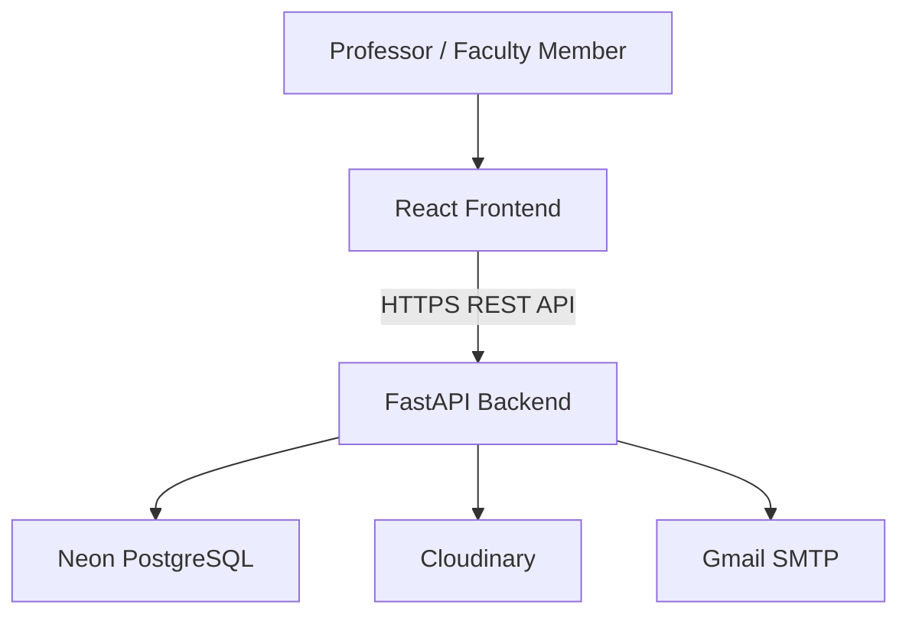
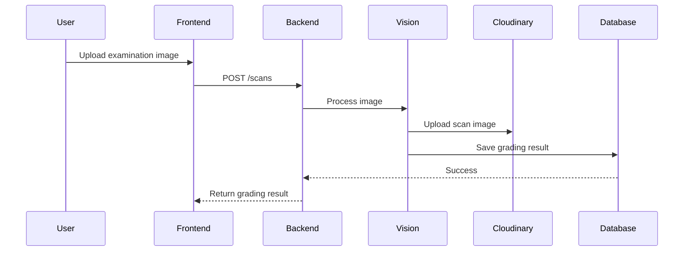

# System Architecture

This document describes the overall software architecture of SnapChecker, including the application's layered design, component responsibilities, data flow, and architectural decisions.

SnapChecker follows a client-server architecture that separates the presentation layer, business logic, data persistence, and external service integrations into independent components. This separation improves maintainability, scalability, and long-term extensibility.

---

# Architectural Overview



The frontend is responsible for user interaction and presentation, while the backend handles authentication, business rules, image processing, database operations, and communication with external services.

---

# Architecture Layers

SnapChecker is organized into four primary layers.

| Layer              | Responsibility                        |
| ------------------ | ------------------------------------- |
| Presentation Layer | User interface and user interaction   |
| Application Layer  | Business logic and request processing |
| Data Layer         | Persistent application data           |
| External Services  | Cloud storage and email integration   |

Each layer has a single responsibility and communicates only with the adjacent layers.

---

# Frontend Architecture

The frontend is implemented as a feature-based React application.

Rather than organizing components solely by type, application functionality is grouped into independent feature modules. This approach improves maintainability by keeping related components, hooks, and business logic together.

## High-Level Structure

```text
src/

api/
components/
features/
pages/
store/
utils/
```

## Responsibilities

### API Layer

The `api` directory provides a centralized interface for communication with the backend.

Responsibilities include:

- HTTP client configuration
- Authentication requests
- Classroom services
- Scanner services
- Template services
- Gradebook services

This abstraction prevents UI components from directly managing HTTP requests.

---

### Components

Reusable UI components are separated from application features.

Examples include:

- Buttons
- Inputs
- Cards
- Modals
- Navigation
- Layout components

These components contain presentation logic only and remain reusable across multiple features.

---

### Features

Business functionality is organized into independent feature modules.

Current feature modules include:

- Assessment
- Classroom
- Gradebook
- Scanner
- Template Builder

Each feature contains its own components and supporting logic where appropriate.

---

### Global State

Application state is managed using Zustand.

Global stores are responsible for:

- Authentication state
- Application state

This avoids excessive prop drilling while keeping state management lightweight.

---

### Utilities

Shared utility functions are isolated from business logic.

Examples include:

- PDF generation
- CSV export

---

# Backend Architecture

The backend follows a layered architecture that separates HTTP request handling from business logic and infrastructure concerns.

## High-Level Structure

```text
app/

auth/
models/
routes/
security/
services/
```

Each module has a clearly defined responsibility.

---

## Routes

Route modules expose REST API endpoints.

Responsibilities include:

- Request validation
- Authentication dependencies
- Response formatting
- Delegating business logic

Routes intentionally contain minimal business logic.

---

## Services

The service layer contains the application's business logic.

Examples include:

- Grading
- Item analysis
- Student matching
- Gradebook generation
- Storage management
- Cloudinary integration

Keeping business logic inside services improves testability and prevents duplicated logic across multiple endpoints.

---

## Authentication

Authentication functionality is isolated into its own module.

Responsibilities include:

- Registration
- Login
- Refresh tokens
- Email verification
- Password reset
- Password changes

JWT authentication is implemented using short-lived access tokens together with HttpOnly refresh cookies.

---

## Security

Security concerns are separated from business logic.

Current responsibilities include:

- JWT validation
- Password hashing
- Authentication dependencies
- Rate limiting

This organization centralizes security-related functionality and simplifies future maintenance.

---

## Data Models

Database models define the persistent structure of the application.

SQLAlchemy is used as the Object Relational Mapper (ORM), while Alembic manages database schema migrations.

---

# Request Lifecycle

The following sequence illustrates a typical assessment scan request.



Although individual endpoints perform different operations, most requests follow this same lifecycle:

1. Client request
2. Request validation
3. Business logic execution
4. Database and external service interaction
5. API response

---

# Data Flow

Application data generally flows in a single direction.

```text
User

↓

React Components

↓

API Services

↓

FastAPI Routes

↓

Business Services

↓

Database / External Services
```

This layered flow keeps presentation logic independent from persistence and infrastructure.

---

# Architectural Decisions

Several design decisions were made to improve maintainability and scalability.

## Feature-Based Frontend

The frontend is organized by business features instead of individual component types.

This improves modularity and keeps related functionality together.

---

## Layered Backend

Business logic is separated from routing and infrastructure.

This allows services to be reused across multiple endpoints while keeping route handlers concise.

---

## Cloud Image Storage

Uploaded examination scans are stored in Cloudinary rather than on the application server.

Only image references are stored within the database, reducing server storage requirements and simplifying media management.

---

## Environment-Based Configuration

Application configuration is managed through environment variables.

This allows the same codebase to support both development and production environments without modification.

---

## Automatic Deployment

Production deployments are automatically triggered through GitHub integrations with Render and Vercel.

This reduces manual deployment effort while ensuring the deployed application remains synchronized with the production branch.

---

# Scalability Considerations

The current architecture was designed to support future expansion.

Potential future enhancements include:

- Additional assessment formats
- Multi-role user management
- Analytics dashboards
- Notification services
- Horizontal API scaling
- Object storage migration
- Background job processing

The existing layered architecture allows these features to be introduced with minimal impact on the overall system.

---

# Related Documentation

- **README.md** — Project overview
- **DEVELOPMENT_SETUP.md** - Local development and installation guide
- **DEPLOYMENT.md** — Deployment architecture and infrastructure
- **DATABASE.md** — Database schema and relationships
- **API.md** — Backend API reference
- **PRODUCTION_CHECKLIST.md** — Production verification checklist
