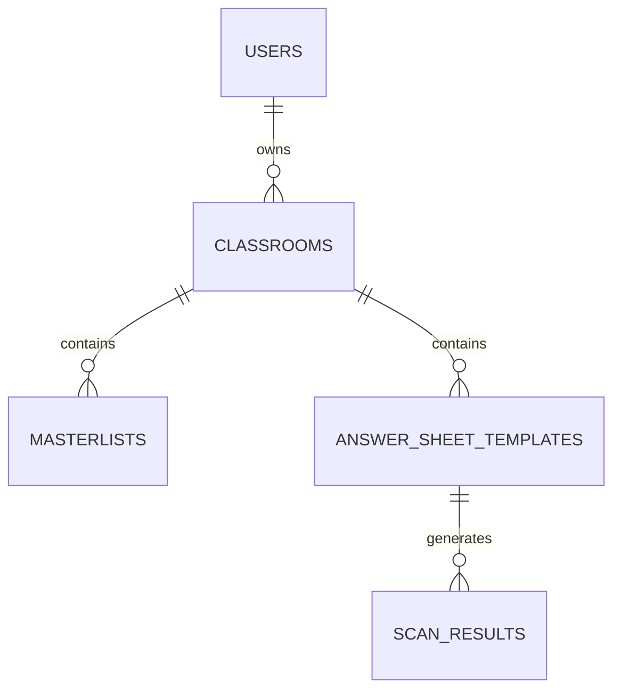

# Database Design

This document describes the database structure used by SnapChecker, including entity relationships, table responsibilities, and key design decisions.

SnapChecker uses PostgreSQL as its primary relational database management system, with SQLAlchemy serving as the Object Relational Mapper (ORM) and Alembic managing schema migrations.

---

# Database Overview

The database is designed around the concept of ownership.

Each authenticated faculty account owns one or more classrooms, which in turn contain student rosters, assessment templates, and grading records.



This hierarchy ensures that deleting a parent entity automatically removes all dependent records through cascading relationships.

---

# Entity Relationships

| Parent              | Child               | Relationship |
| ------------------- | ------------------- | ------------ |
| User                | Classroom           | One-to-Many  |
| Classroom           | Masterlist          | One-to-Many  |
| Classroom           | AnswerSheetTemplate | One-to-Many  |
| AnswerSheetTemplate | ScanResult          | One-to-Many  |

All primary relationships enforce cascading deletion to preserve referential integrity.

---

# Tables

## Users

The `users` table stores faculty accounts and serves as the root entity of the application.

### Responsibilities

- Account authentication
- Faculty profile information
- Email verification status
- Classroom ownership

### Primary Fields

| Field         | Description                 |
| ------------- | --------------------------- |
| id            | Primary key                 |
| email         | Unique login credential     |
| password_hash | Hashed account password     |
| full_name     | Faculty name                |
| school_name   | Institution                 |
| department    | Academic department         |
| is_active     | Account status              |
| is_verified   | Email verification status   |
| created_at    | Account creation timestamp  |
| updated_at    | Last modification timestamp |

---

## Classrooms

The `classrooms` table organizes assessments into independent teaching environments.

Each classroom belongs to exactly one faculty member.

### Responsibilities

- Classroom organization
- Subject information
- Academic term management

### Primary Fields

| Field         | Description               |
| ------------- | ------------------------- |
| id            | Primary key               |
| owner_id      | Owning faculty account    |
| name          | Classroom name            |
| subject_name  | Subject title             |
| academic_term | Semester or academic term |
| created_at    | Creation timestamp        |

### Constraints

Each faculty member may not create two classrooms with the same name.

This is enforced through a composite unique constraint.

---

## Masterlists

The `masterlists` table stores student roster information for each classroom.

### Responsibilities

- Student roster
- Student identification
- CSV imports

### Primary Fields

| Field        | Description        |
| ------------ | ------------------ |
| id           | Primary key        |
| classroom_id | Parent classroom   |
| student_name | Student name       |
| student_id   | Student identifier |
| created_at   | Creation timestamp |

---

## Answer Sheet Templates

The `answer_sheet_templates` table stores reusable assessment templates.

### Responsibilities

- Answer key storage
- Examination configuration
- Template layout information

### Primary Fields

| Field           | Description                 |
| --------------- | --------------------------- |
| id              | Primary key                 |
| classroom_id    | Parent classroom            |
| name            | Template name               |
| exam_type       | Assessment type             |
| test_directions | Examination instructions    |
| num_items       | Number of questions         |
| num_choices     | Number of answer choices    |
| answer_key_json | Serialized answer key       |
| layout_data     | Canvas layout configuration |
| is_active       | Template status             |
| created_at      | Creation timestamp          |

---

## Scan Results

The `scan_results` table stores processed examination results.

Unlike the student roster, scan results represent immutable historical assessment records.

### Responsibilities

- OMR grading results
- Student answer storage
- Cloud image references
- Annotation metadata

### Primary Fields

| Field                | Description                |
| -------------------- | -------------------------- |
| id                   | Primary key                |
| template_id          | Assessment template        |
| raw_ocr_name         | OCR-detected student name  |
| matched_student_name | Matched roster name        |
| raw_ocr_section      | OCR-detected section       |
| detected_student_id  | OCR-detected identifier    |
| score                | Student score              |
| total_items          | Number of assessment items |
| student_answers_json | Student responses          |
| item_results_json    | Per-question grading       |
| original_image_url   | Cloud image URL            |
| cloudinary_public_id | Cloudinary identifier      |
| annotations_json     | Review annotations         |
| needs_review         | Manual review indicator    |
| created_at           | Assessment timestamp       |

---

# Cascading Relationships

All major parent-child relationships use cascading deletion.

This ensures dependent records are automatically removed whenever a parent entity is deleted.

Examples include:

- Deleting a faculty account removes owned classrooms.
- Deleting a classroom removes student rosters and templates.
- Deleting a template removes associated scan results.

This prevents orphaned records while simplifying long-term database maintenance.

---

# JSON-Based Storage

Several database fields intentionally use PostgreSQL JSON columns instead of normalized relational tables.

Current JSON fields include:

| Column               | Purpose                   |
| -------------------- | ------------------------- |
| answer_key_json      | Assessment answer key     |
| layout_data          | Template Builder layout   |
| student_answers_json | Student responses         |
| item_results_json    | Per-item grading results  |
| annotations_json     | Manual review annotations |

Using JSON allows flexible storage of structured assessment data while avoiding unnecessary table complexity.

---

# Historical Data Preservation

Scan results intentionally store snapshots of student information instead of maintaining direct foreign key relationships to the classroom roster.

This design preserves historical assessment records even if student roster information changes after an examination has been graded.

Captured snapshot information includes:

- OCR-detected student name
- Matched student name
- Student identifier
- Examination score
- Student responses

This approach ensures assessment records remain historically accurate.

---

# Migration Strategy

Database schema changes are managed using Alembic migrations.

Production schema updates should always be applied using:

```bash
alembic upgrade head
```

Manual modification of production tables is discouraged.

---

# Design Principles

The database follows several core design principles.

## Ownership Hierarchy

Every record ultimately belongs to a faculty account through cascading ownership.

---

## Referential Integrity

Foreign key constraints maintain consistent relationships throughout the database.

---

## Historical Accuracy

Assessment results remain unchanged after grading by storing snapshot information instead of relying solely on mutable relational records.

---

## Flexible Assessment Data

Complex grading information is stored using JSON columns to support evolving assessment formats without frequent schema changes.

---

# Related Documentation

- **README.md** — Project overview
- **DEPLOYMENT.md** — Infrastructure and deployment
- **ARCHITECTURE.md** — Application architecture
- **API.md** — Backend API reference
- **PRODUCTION_CHECKLIST.md** — Production verification
