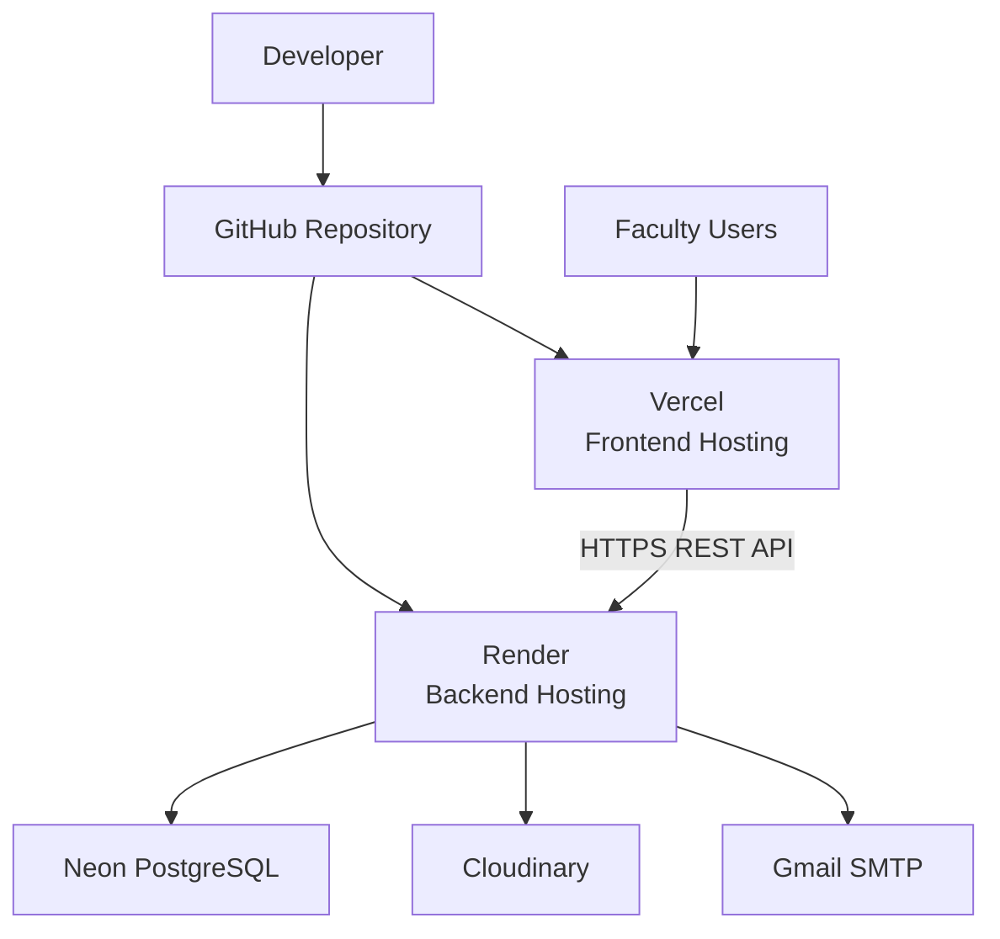

# Deployment Guide

This document describes the production deployment architecture, infrastructure components, environment configuration, and operational considerations required to deploy and maintain SnapChecker.

The deployment strategy separates the frontend, backend, database, cloud storage, and email services into independently managed cloud platforms while using GitHub as the central source of truth for automated deployments.

---

# Deployment Architecture



The application follows a cloud-native deployment model where each major service is hosted independently. Source code changes are managed through GitHub, while production deployments are automatically triggered by commits to the configured production branch.

---

# Infrastructure Components

| Component      | Platform        | Responsibility                                  |
| -------------- | --------------- | ----------------------------------------------- |
| Frontend       | Vercel          | Hosts the React single-page application         |
| Backend        | Render          | Hosts the FastAPI REST API                      |
| Database       | Neon PostgreSQL | Stores application and assessment data          |
| Image Storage  | Cloudinary      | Stores uploaded examination scans               |
| Email Service  | Gmail SMTP      | Sends verification and password recovery emails |
| Source Control | GitHub          | Version control and automatic deployments       |

---

# Deployment Workflow

Production deployments follow the workflow below.

```text
Developer

      │

      ▼

GitHub Repository

      │

Automatic Deployment

      │

 ┌───────────────┐
 │               │
 ▼               ▼

Render        Vercel

      │

Production Environment
```

Any changes pushed to the configured production branch automatically trigger new deployments for both the frontend and backend services.

---

# Backend Deployment

The backend application is deployed as a FastAPI web service on Render.

## Responsibilities

The backend is responsible for:

- Authentication and authorization
- Business logic
- Database operations
- OMR processing
- Cloudinary integration
- Email services
- Storage quota enforcement
- REST API endpoints

## Deployment Requirements

The backend requires:

- Python runtime
- Dependencies from `requirements.txt`
- Production environment variables
- Access to the production PostgreSQL database
- Cloudinary credentials
- SMTP credentials

## Database Migration

Whenever database schema changes are introduced through Alembic migrations, the production database must be updated.

```bash
alembic upgrade head
```

This command applies all pending migrations to the production database.

---

# Frontend Deployment

The frontend application is deployed on Vercel as a React single-page application.

## Responsibilities

The frontend is responsible for:

- User interface
- Authentication flow
- Assessment management
- Template Builder
- Scanner interface
- Gradebook
- Communication with the backend API

## Deployment Requirements

The frontend requires:

- Node.js
- Project dependencies
- Production environment variables

The frontend communicates exclusively with the deployed backend through HTTPS REST API requests.

---

# Environment Configuration

SnapChecker relies entirely on environment variables for production configuration. Secrets and credentials should never be committed to source control.

## Backend Environment Variables

| Variable                   | Purpose                        |
| -------------------------- | ------------------------------ |
| DATABASE_URL               | PostgreSQL database connection |
| SECRET_KEY                 | JWT signing key                |
| CLOUDINARY_URL             | Cloudinary authentication      |
| SMTP_HOST                  | SMTP server                    |
| SMTP_PORT                  | SMTP server port               |
| SMTP_USER                  | Email account                  |
| SMTP_PASSWORD              | Email account password         |
| FRONTEND_URL               | Production frontend URL        |
| BACKEND_CORS_ORIGINS       | Allowed frontend origins       |
| STORAGE_SCAN_IMAGE_LIMIT   | Maximum stored scan images     |
| STORAGE_GRADE_RECORD_LIMIT | Maximum stored grade records   |
| COOKIE_SECURE              | Enables HTTPS-only cookies     |
| COOKIE_SAMESITE            | Cookie cross-site policy       |

## Frontend Environment Variables

| Variable     | Purpose              |
| ------------ | -------------------- |
| VITE_API_URL | Backend API base URL |

Example:

```env
VITE_API_URL=https://your-backend-url/api
```

---

# External Services

## Neon PostgreSQL

Neon stores all persistent application data including:

- Users
- Classrooms
- Student rosters
- Templates
- Assessment records
- Scan results

---

## Cloudinary

Cloudinary stores uploaded examination scan images.

Only the image URL and Cloudinary public identifier are stored within the database.

This architecture minimizes storage usage while allowing images to be deleted directly through the Cloudinary API when no longer required.

---

## Gmail SMTP

SMTP is used for:

- Email verification
- Password recovery

The backend communicates directly with the configured SMTP server to deliver account-related emails.

---

# Production Configuration

## Authentication

SnapChecker uses:

- JWT Access Tokens
- HttpOnly Refresh Cookies

This approach reduces client-side exposure of authentication credentials while allowing persistent login sessions.

---

## Cookie Configuration

Production deployments should use:

```env
COOKIE_SECURE=true
COOKIE_SAMESITE=none
```

Development environments typically use:

```env
COOKIE_SECURE=false
COOKIE_SAMESITE=lax
```

These settings ensure refresh cookies function correctly across HTTPS deployments while maintaining compatibility during local development.

---

## Cross-Origin Resource Sharing (CORS)

Only trusted frontend origins should be included in:

```text
BACKEND_CORS_ORIGINS
```

Production deployments should include the deployed frontend URL, while local development environments may additionally include localhost origins.

---

## Storage Quotas

Storage limits are configurable through environment variables.

Current configurable limits include:

- Uploaded scan images
- Stored grade records

These limits help prevent excessive storage consumption and encourage efficient resource usage.

---

# Deployment Verification

After deployment, verify the following functionality before considering the release production-ready.

## Authentication

- Register account
- Verify email
- Login
- Refresh session
- Logout
- Forgot password
- Change password

---

## Classroom

- Create classroom
- Update classroom
- Delete classroom

---

## Student Management

- Import CSV
- Add students
- Delete students

---

## Assessment

- Create template
- Save template
- Reopen template

---

## Scanner

- Upload examination image
- Process grading
- Upload image to Cloudinary
- Save assessment result

---

## Gradebook

- Export PDF
- Export CSV
- Generate analytics

---

# Common Deployment Issues

## Refresh session immediately logs out

**Cause**

Cross-site cookies were configured using development settings.

**Resolution**

Use:

```env
COOKIE_SECURE=true
COOKIE_SAMESITE=none
```

for production deployments.

---

## Frontend deployment fails during build

**Cause**

Missing frontend dependency.

**Resolution**

Install the missing package, update `package-lock.json`, commit the changes, and redeploy.

---

## Cloudinary uploads fail

**Cause**

Missing or invalid Cloudinary credentials.

**Resolution**

Verify that `CLOUDINARY_URL` is correctly configured in the backend environment.

---

## Database migration errors

**Cause**

Production schema is not synchronized with the latest Alembic migration.

**Resolution**

Run:

```bash
alembic upgrade head
```

before starting the application.

---

# Related Documentation

- **README.md** — Project overview
- **ARCHITECTURE.md** — System architecture
- **DATABASE.md** — Database design
- **API.md** — Backend API reference
- **PRODUCTION_CHECKLIST.md** — Production verification checklist
