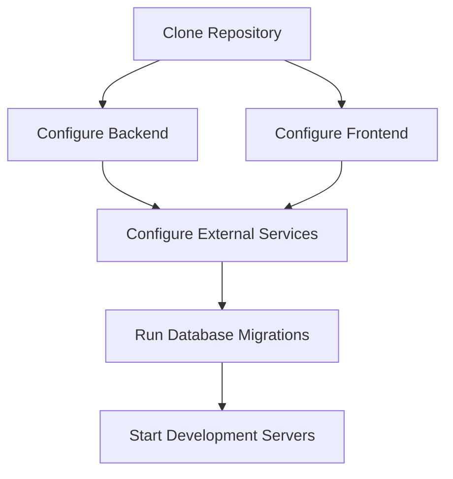

# Development Setup Guide

This document explains how to configure and run SnapChecker in a local development environment after cloning the repository.

Unlike the production deployment guide, this document focuses on local development using your own database, cloud storage, and email service accounts.

---

# Development Workflow



Following this workflow ensures that every required dependency and external service is configured before running the application.

---

# System Requirements

Install the following software before beginning development.

| Software | Recommended Version   |
| -------- | --------------------- |
| Python   | 3.13 or later         |
| Node.js  | 20 or later           |
| npm      | Included with Node.js |
| Git      | Latest Stable Version |

---

# Clone the Repository

Clone the project repository.

```bash
git clone <repository-url>
```

Move into the project directory.

```bash
cd SnapChecker
```

---

# Backend Setup

Navigate to the backend directory.

```bash
cd backend
```

Create a virtual environment.

```bash
python -m venv .venv
```

Activate the virtual environment.

### Windows

```bash
.venv\Scripts\activate
```

### Linux / macOS

```bash
source .venv/bin/activate
```

Install the required Python packages.

```bash
pip install -r requirements.txt
```

---

# Frontend Setup

Open another terminal and navigate to the frontend directory.

```bash
cd frontend
```

Install the project dependencies.

```bash
npm install
```

---

# Environment Configuration

SnapChecker uses environment variables to separate development configuration from production configuration.

Never commit actual credentials into the repository.

---

## Backend Environment

Create a new file:

```text
backend/.env
```

using:

```text
backend/.env.example
```

Configure the following variables.

| Variable                   | Required | Description                            |
| -------------------------- | :------: | -------------------------------------- |
| DATABASE_URL               |    ✅    | PostgreSQL connection string           |
| SECRET_KEY                 |    ✅    | JWT signing key                        |
| CLOUDINARY_URL             |    ✅    | Cloudinary credentials                 |
| SMTP_HOST                  |    ✅    | SMTP server hostname                   |
| SMTP_PORT                  |    ✅    | SMTP server port                       |
| SMTP_USER                  |    ✅    | Email account                          |
| SMTP_PASSWORD              |    ✅    | Email password or application password |
| FRONTEND_URL               |    ✅    | Local frontend URL                     |
| BACKEND_CORS_ORIGINS       |    ✅    | Allowed frontend origins               |
| STORAGE_SCAN_IMAGE_LIMIT   |    ✅    | Maximum stored scan images             |
| STORAGE_GRADE_RECORD_LIMIT |    ✅    | Maximum stored academic records        |
| COOKIE_SECURE              |    ✅    | HTTPS cookie configuration             |
| COOKIE_SAMESITE            |    ✅    | Cookie cross-site policy               |

Typical development values include:

```env
FRONTEND_URL=http://localhost:5173

BACKEND_CORS_ORIGINS=http://localhost:5173,http://127.0.0.1:5173

COOKIE_SECURE=false

COOKIE_SAMESITE=lax
```

---

## Frontend Environment

Create:

```text
frontend/.env
```

Configure:

```env
VITE_API_URL=http://localhost:8000/api
```

---

# External Service Accounts

SnapChecker relies on several third-party services.

Developers should create their own accounts rather than using existing production credentials.

| Service             | Purpose                                  |
| ------------------- | ---------------------------------------- |
| Neon PostgreSQL     | Database                                 |
| Cloudinary          | Image storage                            |
| Gmail SMTP          | Email verification and password recovery |
| Render _(Optional)_ | Backend deployment                       |
| Vercel _(Optional)_ | Frontend deployment                      |

Once created, copy the appropriate credentials into the backend `.env` file.

---

# Database Initialization

After configuring the database connection, initialize the schema using Alembic.

```bash
alembic upgrade head
```

This applies all available database migrations.

---

# Running the Application

## Start the Backend

Navigate to the backend directory.

```bash
cd backend
```

Activate the virtual environment.

Start the development server.

```bash
uvicorn app.main:app --reload
```

Backend URL:

```text
http://localhost:8000
```

Swagger Documentation:

```text
http://localhost:8000/docs
```

---

## Start the Frontend

Navigate to the frontend directory.

```bash
cd frontend
```

Start the Vite development server.

```bash
npm run dev
```

Frontend URL:

```text
http://localhost:5173
```

---

# Verifying the Installation

After both servers are running, verify that the following features work correctly.

## Application

- Open the frontend application.
- Backend responds successfully.
- Swagger documentation loads.

---

## Authentication

- Register a new account.
- Verify email.
- Login successfully.
- Refresh the browser.
- Logout successfully.
- Forgot password.
- Reset password.

---

## Classroom

- Create classroom.
- Update classroom.
- Delete classroom.

---

## Student Management

- Import CSV roster.
- Add student.
- Update student.
- Delete student.

---

## Assessment

- Create template.
- Save answer key.
- Update template.
- Archive template.

---

## Scanner

- Upload examination image.
- Automatic grading completes.
- Cloudinary image upload succeeds.
- Grade record saved.
- Manual review functions correctly.

---

## Gradebook

- Generate classroom gradebook.
- Generate semester gradebook.
- Export PDF.
- Export CSV.

If all checks pass successfully, the local development environment has been configured correctly.

---

# Project Structure

The repository is organized into three primary directories.

```text
SnapChecker/

backend/
frontend/
docs/
```

| Directory | Purpose                     |
| --------- | --------------------------- |
| backend   | FastAPI backend application |
| frontend  | React frontend application  |
| docs      | Technical documentation     |

---

# Common Development Issues

## CORS Errors

**Cause**

Frontend origin is not included in:

```text
BACKEND_CORS_ORIGINS
```

**Resolution**

Add the frontend URL to the allowed origins and restart the backend.

---

## Login Session Does Not Persist

**Cause**

Incorrect cookie configuration.

**Development Configuration**

```env
COOKIE_SECURE=false

COOKIE_SAMESITE=lax
```

**Production Configuration**

```env
COOKIE_SECURE=true

COOKIE_SAMESITE=none
```

---

## Cloudinary Uploads Fail

**Cause**

Invalid or missing Cloudinary credentials.

**Resolution**

Verify that `CLOUDINARY_URL` has been configured correctly.

---

## Email Verification Does Not Work

**Cause**

SMTP credentials are missing or invalid.

**Resolution**

Verify the configured SMTP server and application password.

---

## Database Migration Errors

**Cause**

Database schema has not been initialized.

**Resolution**

Run:

```bash
alembic upgrade head
```

---

## Frontend Build Errors

**Cause**

Missing npm dependencies.

**Resolution**

Run:

```bash
npm install
```

inside the frontend directory.

---

# Next Steps

After successfully configuring the local development environment, developers may customize the application by:

- Connecting a different PostgreSQL database.
- Using a different SMTP provider.
- Deploying the backend to another cloud platform.
- Deploying the frontend to another hosting provider.
- Extending existing features or implementing new functionality.

For production deployment instructions, refer to **DEPLOYMENT.md**.

For application architecture, refer to **ARCHITECTURE.md**.

For API details, refer to **API.md**.
